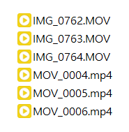
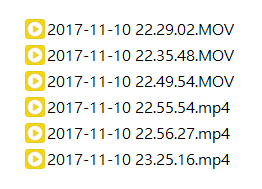

# Namediainfo

[](./LICENSE)


Namediainfo is a tool to rename video files based on ***Encoded Date***.

## Overview

Make your life easier.

|Before|After|
|:---:|:---:|
|||

## Dependencies

- Python 2.7
- [MediaInfo](https://mediaarea.net/en/MediaInfo)
- [pymediainfo](https://pymediainfo.readthedocs.io/)

## Usage

```bash
$ python namediainfo.py -h
usage: namediainfo.py [-h] -d DIRECTORY -p PATTERN [-o OFFSET]

Rename all video files in a directory to their encoded dates.

optional arguments:
  -h, --help    show this help message and exit
  -d DIRECTORY  target directory
  -p PATTERN    output pattern
  -o OFFSET     hours to shift
```

Example:

```bash
$ python namediainfo.py -d './videos/' -p '%Y-%m-%d %H.%M.%S' -o -7
rename ./videos/IMG_0762.MOV -> ./videos/2017-11-10 22.29.02.MOV
rename ./videos/IMG_0763.MOV -> ./videos/2017-11-10 22.35.48.MOV
rename ./videos/IMG_0764.MOV -> ./videos/2017-11-10 22.49.54.MOV
rename ./videos/MOV_0004.mp4 -> ./videos/2017-11-10 22.55.54.mp4
rename ./videos/MOV_0005.mp4 -> ./videos/2017-11-10 22.56.27.mp4
rename ./videos/MOV_0006.mp4 -> ./videos/2017-11-10 23.25.16.mp4
```
